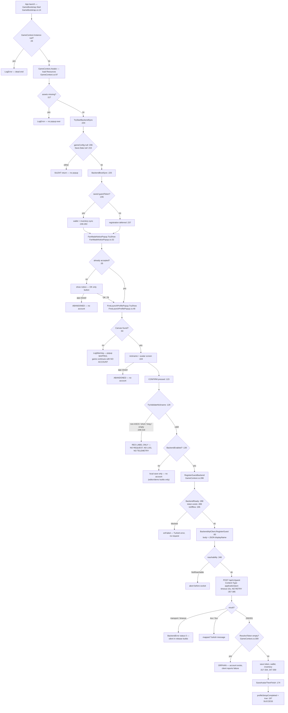

# Unity client: why an install may never create an account

**Date:** 2026-08-03
**Client source:** `C:\Users\cenk_\ValoCase` — Unity `6000.4.11f1`, `bundleVersion: 1.0.19`,
`AndroidBundleVersionCode: 19`. Matches the production build under investigation.
**Config:** `Assets/_ValoCase/Resources/GameConfig.asset` — `useBackend: 1`,
`backendBaseUrl: https://valocase-backend-digitalocean-isy6d.ondigitalocean.app`,
`requestTimeoutSeconds: 15`.

All paths below are relative to `C:\Users\cenk_\ValoCase\Assets\_ValoCase\Scripts`.
No code has been modified.

---

## The finding that changes the plan

**The client enforces the same ASCII-only nickname rule as the server, before sending
anything.** `FirstLaunchProfilePopup.cs:213-218`:

```csharp
foreach (var c in trimmed)
{
    bool ok = (c >= 'A' && c <= 'Z') || (c >= 'a' && c <= 'z') ||
              (c >= '0' && c <= '9') || c == '_';
    if (!ok) { error = "Only letters, digits and _ are allowed."; return false; }
}
```

`OnConfirmClicked` calls this at line 129 and **returns at line 133 before
`RegisterGuestBackend` is ever reached** (line 145). A player typing `Çınar`,
`Ahmet Yılmaz` or `Mehmet-53` gets a red line under the field and **no HTTP request
is sent at all**.

Two consequences, both important:

1. **The backend diagnostics I added last turn cannot detect this.** `INVALID_CHARSET`
   will read **zero** no matter how many Turkish players are blocked, because the
   request never leaves the phone. `guest_registration_started` will also stay flat.
   The counter I told you would be decisive is, for this failure mode, blind.
2. **This rejection has no telemetry whatsoever.** `TryValidateNickname` returns
   `false`, `ShowError` writes to a UI label (line 222-225), and nothing is logged —
   there is no `Debug.Log` on any validation-failure branch. The player sees an error,
   closes the app, and no system anywhere records that it happened.

I can prove the rule blocks those names and that no request is sent. I **cannot**
prove from source how many players hit it — that needs client telemetry that does not
currently exist.

---

## 1. Complete first-launch flow

| Step | File:line |
|---|---|
| `GameBootstrap.Start` — shows loading screen, waits `minimumLoadSeconds` (1.2s) | `Core/GameBootstrap.cs:14-24` |
| aborts if `GameContext.Instance == null` | `Core/GameBootstrap.cs:26-30` |
| loads the Main scene | `Core/GameBootstrap.cs:32-34` |
| `GameContext.Awake` — loads 3 `Resources` assets | `Core/GameContext.cs:97-115` |
| aborts if any asset is missing | `Core/GameContext.cs:117-121` |
| `InitializeServices` → `ProfileManager.EnsureInitialized()` | `Core/GameContext.cs:143-170` |
| `TryStartBackendSync` | `Core/GameContext.cs:197, 204` |
| constructs `BackendApiClient`, starts `BackendBootSync` | `Core/GameContext.cs:217-222` |
| **no saved token → registration deferred**, chains to the notice popup | `Core/GameContext.cs:235-240` |
| (with token) wallet → inventory → notice popup | `Core/GameContext.cs:246-268` |
| `FanMadeNoticePopup.TryShow` — legal gate | `UI/FanMadeNoticePopup.cs:32-39` |
| OK → persists flag → chains onward | `UI/FanMadeNoticePopup.cs:78-84` |
| `FirstLaunchProfilePopup.TryShow` → `Start` → `BuildUi` | `UI/FirstLaunchProfilePopup.cs:48, 82, 104` |
| `OnConfirmClicked` → validate → register | `UI/FirstLaunchProfilePopup.cs:123-145` |
| `GameContext.RegisterGuestBackend` → `RegisterGuestRoutine` | `Core/GameContext.cs:286, 293` |
| `BackendApiClient.RegisterGuest` → `Send` | `Services/Backend/BackendApiClient.cs:60-66, 316` |
| `POST /api/v1/guest` | `Services/Backend/BackendApiClient.cs:385` |

## 2. Exactly when POST /api/v1/guest is called

**One call site in the entire client** (verified by grep across all 142 scripts):

- `UI/FirstLaunchProfilePopup.cs:145` → `GameContext.RegisterGuestBackend`
- which is the only caller of `Backend.RegisterGuest` at `Core/GameContext.cs:305`

It fires **only** when the CONFIRM button on the first-launch nickname popup is
pressed **and** the typed nickname passes client validation **and** `ctx.BackendEnabled`
is true (`FirstLaunchProfilePopup.cs:139`).

Nothing else registers. Launching the app, browsing, or any other screen never creates
an account — this is deliberate, documented at `Core/GameContext.cs:229-234`.

## 3. Every condition that prevents the request being sent

Ordered by how early it cuts in.

**Before the popup can ever appear**

| # | Condition | File:line | Symptom |
|---|---|---|---|
| 1 | `GameContext.Instance == null` | `Core/GameBootstrap.cs:26` | LogError, app stuck on bootstrap |
| 2 | any of contentDatabase / gameConfig / rarityVisuals missing | `Core/GameContext.cs:117-121` | LogError, `InitializeServices` never runs, **no popup ever** |
| 3 | `gameConfig == null` | `Core/GameContext.cs:206` | **silent return**, no popup |
| 4 | `Save?.Data == null` | `Core/GameContext.cs:215` | **silent return**, no popup, no client constructed |
| 5 | `FindPopupParent()` returns null (no `SafeArea`, no root Canvas) | `UI/FanMadeNoticePopup.cs:52-57`, `UI/FirstLaunchProfilePopup.cs:94-100` | LogWarning only — *"popup skipped this session"*. Player reaches the game with **no account** |
| 6 | fan-made notice shown but never accepted | `UI/FanMadeNoticePopup.cs:35, 78` | nickname popup never chains |
| 7 | `IsSetupComplete` true — `profileSetupCompleted`, or a saved avatar key, or `playerName != "Agent"` | `UI/FirstLaunchProfilePopup.cs:59-75` | popup suppressed permanently |

**At the popup**

| # | Condition | File:line |
|---|---|---|
| 8 | `_saving` already true (double-tap guard) | `UI/FirstLaunchProfilePopup.cs:125` |
| 9 | `ctx == null \|\| ctx.Save?.Data == null` | `UI/FirstLaunchProfilePopup.cs:127` — **silent return, no error shown** |
| 10 | nickname empty | `:209` |
| 11 | nickname < 3 chars | `:210` |
| 12 | nickname > 20 chars | `:211` (also hard-capped by `characterLimit = 20` at `:363`) |
| 13 | **any non-ASCII character** — Turkish letters, spaces, dashes, apostrophes | `:213-218` |
| 14 | `ctx.BackendEnabled == false` | `:139` → local branch at `:168-171` marks setup complete with **no account** |

**In the registration call**

| # | Condition | File:line |
|---|---|---|
| 15 | `!BackendReady` (`Backend == null`) | `Core/GameContext.cs:288` |
| 16 | a `guestToken` already saved | `Core/GameContext.cs:289` — returns `onDone(false)`, skips registration by design |
| 17 | `Application.internetReachability == NotReachable` | `Core/GameContext.cs:295-299` — refused **before** any socket is opened |
| 18 | same reachability check again at the transport layer | `Services/Backend/BackendApiClient.cs:346-355` |

Conditions 3, 4 and 9 are **silent returns with no log and no UI feedback** — the
player sees nothing happen at all.

## 4. Every place the nickname screen can be abandoned

1. **Player closes the app at the fan-made notice.** The card has exactly one button,
   OK (`UI/FanMadeNoticePopup.cs:126-140`) — no dismiss, no back handling. Acceptance
   persists to `PlayerPrefs` (`:80-81`), so the notice does not re-show, but no account
   exists yet.
2. **Player closes the app at the nickname screen.** `profileSetupCompleted` is only
   set in `MarkCompleteAndClose` (`UI/FirstLaunchProfilePopup.cs:197`), which runs only
   after a successful save — so the popup correctly re-shows next launch. No account
   until they finish.
3. **Player presses CONFIRM with an invalid name and gives up.** `:133` returns; the
   error label is the only feedback; nothing is recorded.
4. **Canvas not found** — popup destroys itself and the player continues into the game
   permanently unregistered for that session (`:94-100`).
5. **Backend error on confirm** — `SetSaving(false)` at `:157`/`:163`/`:191` re-enables
   the button and shows a Turkish error. The player may retry or quit.
6. **Avatar save fails after the account was created** — `SaveAvatarThenFinish` error
   branch at `:189-192` leaves `profileSetupCompleted` **false** even though the account
   now exists. Next launch re-shows the popup; `RegisterGuestBackend` then short-circuits
   at `Core/GameContext.cs:289` because a token is saved, so it recovers via rename.

There is no Android back-button handler on either popup, and no explicit close control.

## 5. Silent network-failure paths

**In a release build the client logs essentially nothing about a failed request.** Every
diagnostic in `Send` is compiled out:

| Log | File:line | Guard |
|---|---|---|
| request line | `Services/Backend/BackendApiClient.cs:340` | `#if UNITY_EDITOR \|\| DEVELOPMENT_BUILD` |
| offline abort | `:348-351` | same |
| transport failure detail | `:395-398` | same |
| HTTP status + raw body | `:407-414` | same |
| 4xx/5xx detail | `:423-426` | same |
| parse failure | `:440-443` | same |

A Play Store build is neither `UNITY_EDITOR` nor `DEVELOPMENT_BUILD`, so **none of these
execute**. What survives in release: the boot lines at `Core/GameContext.cs:227, 237`
and the registration result at `:336`.

Other silent paths:

- **`Send` swallows nothing but reports through callbacks only** — if a caller passes a
  no-op `onError` the failure vanishes. `BackendBootSync` does exactly this for wallet
  and inventory (`Core/GameContext.cs:257, 263`) — LogWarning only, boot continues.
- **Registration succeeded server-side but the client discards it**:
  `Core/GameContext.cs:308-316`. If `ResolveToken()` returns empty the callback
  `return`s **without setting `registered = true`**, so line 340 reports failure to the
  player — while the account exists in the database with its wallet and starting
  balance. `ResolveToken` (`BackendApiClient.cs:593-598`) falls back
  `guestToken → token → accountId`, and the backend does send `guestToken`, so this
  needs a response-shape change to trigger. It is a real orphan-account path, not a
  likely one.
- **Client-side validation rejection** — no log at all (§0).

## 6. Timeouts, retries, exception handling

- **Timeout: 15 seconds**, from `GameConfig.requestTimeoutSeconds`, applied at
  `BackendApiClient.cs:360`; default constant `DefaultTimeoutSeconds = 15` at `:35`,
  fallback at `:46`.
- **Retries: none.** `Send` (`:316-450`) makes exactly one attempt. Verified by grep:
  the only retry logic in the whole backend-services folder is in
  `AnalyticsLifecycleService.cs:25-27, 113-114` (`MaxStartResumeAttempts = 3`), which
  covers **session lifecycle only**. Registration gets a single shot.
- **Exception handling:** there is no `try/catch` in `Send`. Failures are classified by
  `UnityWebRequest.Result`:
  - `ConnectionError` / `DataProcessingError` → `BackendError(status 0)`, timeout
    inferred by **string-matching `req.error` for "timeout"/"timed out"**
    (`:391-393`) — locale/version sensitive
  - `ProtocolError` or `status >= 400` → parsed `ErrorResponse`, else `req.error` (`:417-433`)
  - unparseable success body → `isInvalidResponse` (`:437-447`)
- **Player-facing mapping:** `BackendErrorMapper.Map` (`:28-51`) — all messages Turkish.
  A `400` from the server maps to `Generic` = *"İşlem başarısız. Lütfen tekrar dene."*
  — so even if a bad nickname reached the server, the player would be told only
  "operation failed, try again", never what was wrong.
- **`IsOffline`** is `Application.internetReachability == NotReachable`
  (`BackendErrorMapper.cs:25`) — a live interface check, not sticky state. Note it
  reports interface presence, not actual connectivity: a captive portal or a connected
  Wi-Fi with no route reads as *reachable* and the request proceeds to a 15s timeout.

## 7. Every path where Unity continues without an account

| Path | File:line | Player experience |
|---|---|---|
| Canvas missing → popup skipped | `UI/FirstLaunchProfilePopup.cs:94-100` | game continues, no account, LogWarning only |
| Notice Canvas missing → chains onward anyway | `UI/FanMadeNoticePopup.cs:52-57` | continues to nickname popup |
| `ctx.Save?.Data == null` on confirm | `UI/FirstLaunchProfilePopup.cs:127` | button does nothing, no message |
| local-economy branch | `UI/FirstLaunchProfilePopup.cs:168-171` | marks setup complete, saves locally, never registers. **Editor/`OFFLINE_DEMO` only** — `CanUseLocalEconomy` returns `false` in player builds (`Core/GameContext.cs:53-63`), so this cannot fire on a Play Store build |
| `Save?.Data == null` at boot | `Core/GameContext.cs:215` | no popup at all |
| `gameConfig == null` at boot | `Core/GameContext.cs:206` | no popup at all |
| missing Resources asset | `Core/GameContext.cs:117-121` | services never initialise |
| token returned but unusable | `Core/GameContext.cs:308-316` | **account exists server-side**, client reports failure |

## 8. Flow diagram



## 9. What this means for the diagnosis

Your data — Google Ads installs, exactly one new account today, and that one your own
ASCII-nicknamed test — is consistent with every funnel step above that has **no
telemetry on either side**:

- players quitting at the fan-made legal notice (`FanMadeNoticePopup.cs:32`)
- players quitting at the nickname screen without pressing CONFIRM
- players blocked by the ASCII-only rule (`FirstLaunchProfilePopup.cs:213-218`)
- installs that never open the app at all (Google Ads counts the install, not the launch)

None of these produce a single byte of evidence anywhere today. The backend counters I
added last turn distinguish "request arrived and was refused" from "no request" — but
every one of these four dies *before* the request, so all four look identical: a flat
`guest_registration_started=0`.

**The next diagnostic has to be client-side**, not backend-side. Three funnel events —
notice shown/accepted, nickname screen shown, CONFIRM pressed with the rejection reason
— would separate all four in a day. That needs an endpoint that accepts pre-account
telemetry, since by definition there is no `X-Guest-Token` yet.

I have not written any of that. Say the word and I will plan it.
